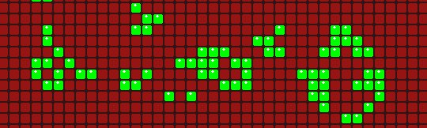

# Conway's Game of Life

One more time, the game of life written in python using pygame.



## Use

Start:
```bash
python src/main.py 
```

You can press `+` or `-` to reduce the speed, `Space` to pause, the mouse to draw
and `esc` or `q` for quit.

## Configuration

The total number of rows, columns, cell size, gap, background color, dead cells color, life cells color and if the cell is not rounded can be changed using the parameters as following:
```bash
python src/main.py --size-x n1\
                   --size-y n2\
                   --cell-size n3\
                   --gap n4\
                   --bg-color red_bg,green_bg,blue_bg\
                   --dead-color red_dead,green_dead,blue_dead\
                   --life-color red_life,green_life,blue_life\
                   --text-color red_text,green_text,blue_text\
                   --not-rounded
```
where `n1,n1,n3,n4` and the `[color]_[type]` are integers.

You can use `--help` to display this help.

